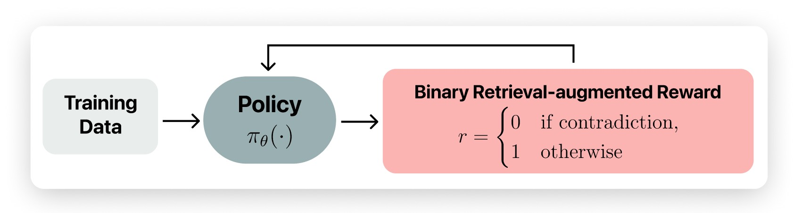

# Train for Truth, Keep the Skills: Binary Retrieval-Augmented Reward (Binary RAR)

<p align="center">
  
</p>

**Binary RAR** is a reinforcement learning (RL) reward for factuality.  
A response receives reward **1** only when the verifier finds **no contradiction** against retrieved documents; otherwise it receives **0**.  
This simple reward reduces hallucination while keeping instruction following, reasoning, and coding skills intact.

📝 [Read the paper](https://arxiv.org/abs/2510.17733)

------

## 📦 1. Models

* **Qwen3-8B + Binary RAR**: 
  [`chentong00/Qwen3-8B-GRPO-Binary-RAR`](https://huggingface.co/chentong00/Qwen3-8B-GRPO-Binary-RAR)

* **Qwen3-4B + Binary RAR**: 
  [`chentong00/Qwen3-4B-GRPO-Binary-RAR`](https://huggingface.co/chentong00/Qwen3-4B-GRPO-Binary-RAR)

------

## 📑 2. Data

8k training instances with cached documents:
[`chentong00/binary-rar-wildchat-8k`](https://huggingface.co/datasets/chentong00/binary-rar-wildchat-8k)

We follow the open-instruct format. Each example contains:

* `id`: identifier from the Tulu3 dataset  
* `messages`: the prompt  
* `ground_truth`: a list with one object containing:  
  * `ground_truth`: the original response  
  * `docs`: a list of document objects (each with `title` and `text`). Each instance is associated with at most 10 documents.

------

## 🔧 3. Training Procedure

<p align="center">
  
</p>

Binary RAR attaches a factuality reward to each rollout:

1. Generate a response  
2. Retrieve top-k evidence using BM25 over cached documents  
3. Verify contradictions using a verifier (e.g., Qwen3-32B)  
4. Assign reward:  
   * **1** if no contradictions  
   * **0** otherwise  
5. Optimize the RL objective with a KL penalty to preserve model utility

------

## 🚀 4. RL Implementation: Thinker

[Tinker](https://thinkingmachines.ai/tinker/) from Thinking Machines Lab is a toolkit that simplifies distributed fine-tuning of large models.

Prepare the environment (see the [official documentation](https://tinker-docs.thinkingmachines.ai/install)):

```bash
pip install tinker
git clone https://github.com/thinking-machines-lab/tinker-cookbook.git
pip install -e tinker-cookbook
````

Launch training:

```bash
python binary_rar_tinker/train.py \
  model_name="Qwen/Qwen3-8B" \
  renderer_name="qwen3" \
  lora_rank=32 \
  verifier_model_name="Qwen/Qwen3-8B" \
  verifier_renderer_name="qwen3_disable_thinking" \
  verifier_max_tokens=512 \
  group_size=16 \
  groups_per_batch=16 \
  learning_rate=1e-5 \
  max_tokens=4096 \
  kl_penalty_coef=0.001 \
  bm25_top_k=8 \
  bm25_chunk_size=512 \
  num_substeps=1 \
  log_path="logs/hallucination" \
  wandb_project="hallucination" \
  wandb_name="run" \
  compute_post_kl=False \
  eval_every=100 \
  save_every=100 \
  behavior_if_log_dir_exists="delete"
```

---

## 🚀 5. RL Implementation: Open-Instruct

[Open-Instruct](https://github.com/allenai/open-instruct) is AI2’s post-training codebase.

Environment setup:

```bash
pip install 'sglang[all]==0.4.6.post4'
git clone https://github.com/allenai/open-instruct
pip install -e open-instruct
```

Start an OpenAI-compatible language model server for the verifier:

```bash
python -m sglang.launch_server \
  --model-path Qwen/Qwen3-32B \
  --host 0.0.0.0 \
  --port 8002 \
  --enable-metrics \
  --dp 4 \
  --tp 2
```

Run the training script:

```bash
source open-instruct/configs/beaker_configs/ray_node_setup.sh
VLLM_OPENAI_BASE_URL=http://<ip>:<port>/v1 \
python binary_rar_open_instruct/grpo_fast_fact.py \
    --model_name_or_path Qwen/Qwen3-8B \
    --chat_template_name None \
    --stop_strings None \
    --exp_name <exp_name> \
    --output_dir <output_dir> \
    --factuality_cache_dir <factuality_cache_dir> \
    --dataset_mixer_list chentong00/binary-rar-wildchat-8k 8192 \
    --dataset_mixer_list_splits train \
    --dataset_mixer_eval_list chentong00/binary-rar-wildchat-8k 32 \
    --dataset_mixer_eval_list_splits train \
    --ground_truths_key ground_truth \
    --shuffle_eval_dataset True \
    --total_episodes 256000 \
    --num_unique_prompts_rollout 16 \
    --num_samples_per_prompt_rollout 8 \
    --max_token_length 8192 \
    --max_prompt_token_length 2048 \
    --response_length 6144 \
    --pack_length 8192 \
    --apply_verifiable_reward true \
    --apply_r1_style_format_reward false \
    --non_stop_penalty true \
    --non_stop_penalty_value 0.0 \
    --verification_reward 1.0 \
    --apply_factuality_reward true \
    --factuality_reward 1.0 \
    --factuality_score_type fact-strict-score \
    --factuality_config_kwargs '{"model_name_verification": "vllm-openai::Qwen/Qwen3-32", "prompt_type": "binary", "search_tokenizer_name": "Qwen/Qwen3-32B", "search_num_processes": 1, "search_chunk_size": 512, "search_num_chunks": 8}' \
    --factuality_metric default \
    --factuality_additional_reward none \
    --deepspeed_stage 3 \
    --per_device_train_batch_size 1 \
    --num_mini_batches 1 \
    --num_learners_per_node 4 \
    --vllm_tensor_parallel_size 1 \
    --vllm_num_engines 4 \
    --lr_scheduler_type linear \
    --learning_rate 1e-6 \
    --beta 0.001 \
    --kl_estimator kl3 \
    --temperature 1.0 \
    --seed 1 \
    --num_evals 10 \
    --save_freq 100 \
    --gradient_checkpointing \
    --with_tracking
```

---

## 🧪 6. Evaluation (FactScore)

We reproduce FactScore to measure hallucination in long-form generation.
We use `gpt-4.1` for claim extraction and `gpt-4.1-mini` for claim verification.
BM25 is used to retrieve chunks from documents associated with each entity.

```bash
python -m fact_eval.run_eval \
  --config fact_eval/configs/factscore-mini.factscore.yaml \
  --model_name <model_name> \
  --model_alias <model_alias> \
  --max_samples 100 \
  --output_dir <output_dir>

python -m fact_eval.run_eval \
  --config fact_eval/configs/factscore-mini.wildhallu.yaml \
  --model_name <model_name> \
  --model_alias <model_alias> \
  --max_samples 100 \
  --output_dir <output_dir>
```

---

```
@misc{chen2025traintruthskillsbinary,
      title={Train for Truth, Keep the Skills: Binary Retrieval-Augmented Reward Mitigates Hallucinations},
      author={Tong Chen and Akari Asai and Luke Zettlemoyer and Hannaneh Hajishirzi and Faeze Brahman},
      year={2025},
      eprint={2510.17733},
      archivePrefix={arXiv},
      primaryClass={cs.CL},
      url={https://arxiv.org/abs/2510.17733},
}
```